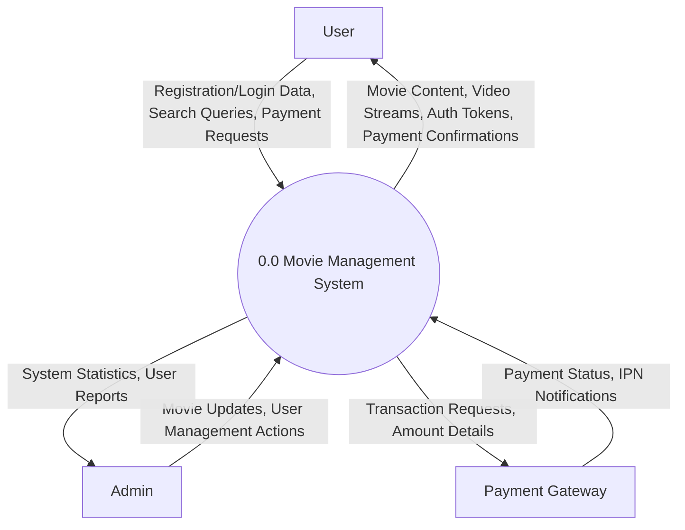
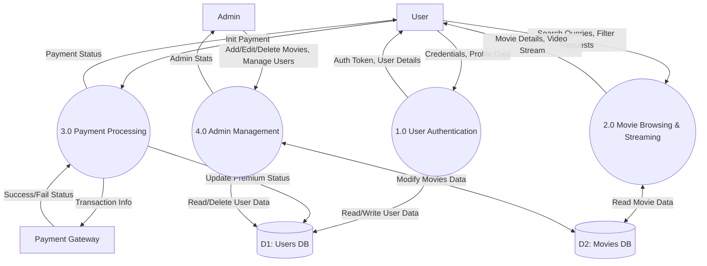

# Data Flow Diagrams (DFD) for Movie Management System

This document contains the Data Flow Diagrams (DFD) for the Movie Management System, detailing the flow of data between external entities, system processes, and data stores. The diagrams are created using Mermaid JS.

## Level 0 DFD (Context Diagram)
The Level 0 DFD shows the entire system as a single process and illustrates its interactions with external entities (Users, Admins, and Payment Gateways).



---

## Level 1 DFD (Main Processes)
The Level 1 DFD breaks down the main system into major sub-processes, showing how data moves between these processes and the data stores (Databases).



---

## Level 2 DFD (Admin Management Process)
The Level 2 DFD provides a deeper dive into the Admin Management process, breaking it down into specific admin capabilities.

```mermaid
flowchart LR
    %% Entities
    Admin[Admin]

    %% Sub-processes
    P41((4.1 Manage Movies))
    P42((4.2 Manage Users))
    P43((4.3 View System Stats))

    %% Data Stores
    D1[(D1: Users DB)]
    D2[(D2: Movies DB)]

    %% 4.1 Manage Movies
    Admin -->|Movie Details (Title, Trailer, Genre)| P41
    P41 <-->|Insert/Update/Delete Movie| D2
    P41 -->|Movie Update Success| Admin

    %% 4.2 Manage Users
    Admin -->|Delete User Request| P42
    P42 <-->|Remove User| D1
    P42 -->|User Removal Confirmation| Admin

    %% 4.3 View System Stats
    Admin -->|Request Stats| P43
    D1 -->|User Count| P43
    D2 -->|Movie Count| P43
    P43 -->|Dashboard Analytics| Admin
```
